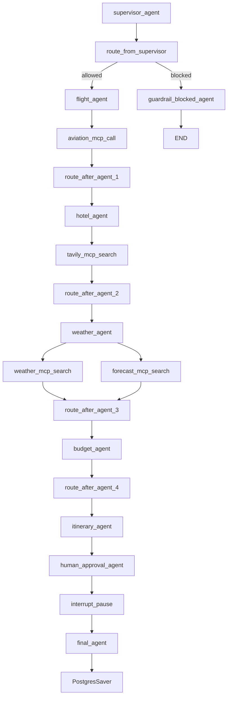

# PlanMyTrip Agent

A multi-agent travel planner built with **LangGraph**, **MCP**, and a **Supervisor + Guardrails + Human-in-the-Loop** architecture. A supervisor agent reads the request, decides which specialist agents are actually needed, and routes between them dynamically instead of running every agent on every request.

A FastAPI backend orchestrates the graph; a Lovable-built frontend consumes it as a JSON API.


## How it fits together

The diagram traces the call graph inside `backend.py`: how a request is validated, routed to the relevant specialist agents, assembled into a draft, paused for human review, and finalized.



- **Guardrail + routing** — `supervisor_agent` runs an input guardrail (blocks off-topic or harmful requests) then decides, per request, which specialist agents actually apply — a "book me a flight" prompt skips `weather_agent` and `budget_agent` entirely, saving LLM calls.
- **Specialist agents** — `flight_agent` calls the AviationStack MCP server, `hotel_agent` and `weather_agent` call Tavily and OpenWeather MCP servers respectively, and `budget_agent` reasons over whatever the earlier agents returned. Each is wrapped in its own `try/except` so one failed tool call degrades gracefully instead of crashing the whole run.
- **Draft + human review** — `itinerary_agent` compiles everything into a draft, then `human_approval_agent` calls LangGraph's `interrupt()` to pause execution entirely — the graph state is checkpointed to Postgres so the pause can survive a server restart or the user coming back hours later.
- **Finalization** — once resumed with `approved: true/false` and optional feedback, `final_agent` produces the polished response, incorporating any revision feedback into the same draft rather than re-running the specialist agents.

## Stack

`FastAPI` · `LangGraph` · `MCP` (Model Context Protocol) · `OpenAI` · `PostgreSQL` (LangGraph checkpointing) · `Tavily` · `AviationStack` · `OpenWeather` · `Lovable` (frontend)

## Project structure

- `app.py` — FastAPI JSON API: `/api/travel`, `/api/travel/approve`, `/health`
- `backend.py` — the LangGraph state machine: supervisor, guardrail, all specialist agents, HITL, and the Postgres checkpointer
- `mcp_client.py` — MCP server connections (Tavily, AviationStack, custom weather server) and the shared LLM client
- `custom_weather_mcp_server.py` — a minimal MCP server wrapping the OpenWeather API
- `Dockerfile` — containerized deploy target (Render)

## Running it locally

```bash
pip install -r requirements.txt
```

Create a `.env` with:

```
OPENAI_API_KEY=
TAVILY_API_KEY=
AVIATION_STACK_API_KEY=
OPENWEATHER_API_KEY=
DATABASE_URL=   # Postgres connection string, for LangGraph checkpointing
```

```bash
python app.py
```

Runs at `http://127.0.0.1:8000`.

## Deployment

Ships with a `Dockerfile` (installs `uv`/`uvx` for the AviationStack MCP server, binds to Render's `$PORT`). Deployed on Render as a web service, with a Render-managed PostgreSQL instance for checkpointing.
